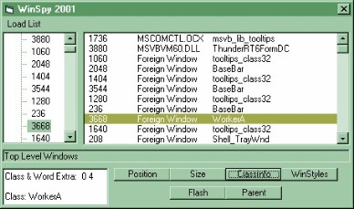



## WinSpy

### Description

It allows the user to navigate through all the Window handles starting at the desktop and veiw both the window handle and class information...

It displays this both in a list box and as a treeview.....
 
### More Info
 

             |
---                |---
**Submitted On**   |2001-06-14 07:59:40
**By**             |[John Bell](https://github.com/Planet-Source-Code/PSCIndex/blob/master/ByAuthor/john-bell.md)
**Level**          |Intermediate
**User Rating**    |5.0 (10 globes from 2 users)
**Compatibility**  |VB 6\.0
**Category**       |[Windows API Call/ Explanation](https://github.com/Planet-Source-Code/PSCIndex/blob/master/ByCategory/windows-api-call-explanation__1-39.md)
**World**          |[Visual Basic](https://github.com/Planet-Source-Code/PSCIndex/blob/master/ByWorld/visual-basic.md)
**Archive File**   |[WinSpy211296142001\.zip](https://github.com/Planet-Source-Code/john-bell-winspy__1-24074/archive/master.zip)

